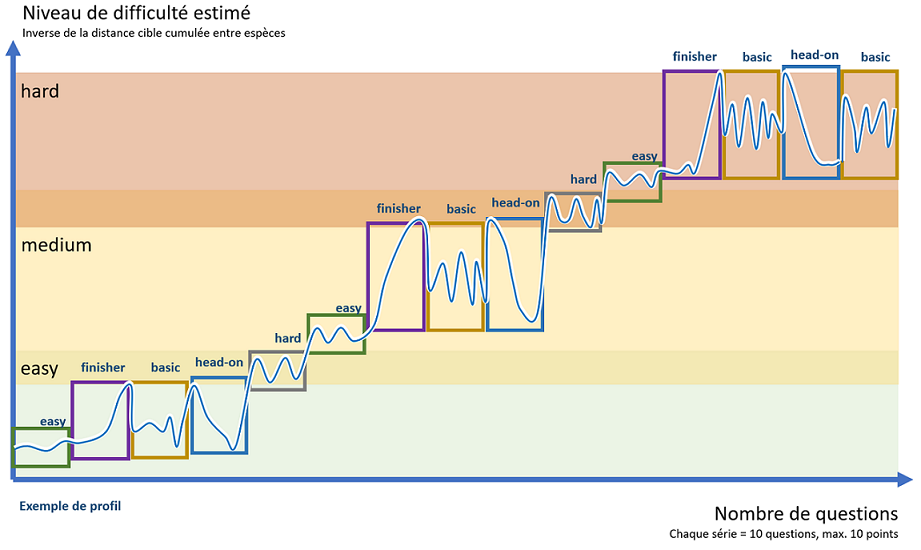
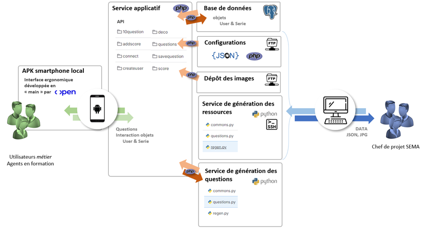
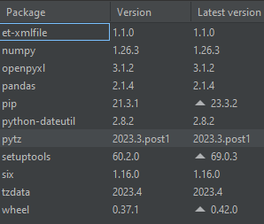

Répertoire proposé pour démonstration de réalisation à Polytech Nantes, 2024. L'intégralité du code exposé a été développé par alexandre.liccardi@ofb.gouv.fr.

Plusieurs parties, en particulier les fichiers SSH et YAML permettant la construction des environnements, ne sont à mis à disposition pour des motifs de sécurité.
La connexion OAuth n'a pas été mise en place (communication avec l'API distante par un token unique).

# POC-reconnaisssance-poissons
conception & développement : alexandre.liccardi@ofb.gouv.fr

## Qu'est-ce que l'API "POC-reconnaisssance-poissons" ?
L'API expose un service https, qui permet à l'utilisateur et au développeur d'accéder :
- aux interactions avec les objets, en particulier Utilisateurs (classe User.php) et Listes de question (classe Serie.php). Il est ainsi possible de créer de noveaux objets, de les détruire, de les sauvegarder et d'utiliser des propriétés précises (notamment récupération du score de l'utilsiateur) ;
- à une fonction précise, qui renvoie une série de questions dynamiquement construite, conformément aux paramètres de difficultés transmis.

## Configurer l'API
### Paramètres techniques PHP
Les paramètres techniques locaux utilisés par PHP sont décrits dans le fichier de [configuration général](pocpoissonAPI/conf/conf.php). Ils sont globalement utilisés **dans les fonctions PHP**. Figurent en particulier les paramètres :
- Chaîne de caractères : paramètres de connexion PG (global $connexion_string) - pour des raisons de sécurité, non publiée (standard "host=xxxx port=xxxx dbname=xxxx user=xxxx password=xxxx")
- Ordre python lancement commande génération 10questions ($py_cmd_questions) - pour des raisons de sécurité, non publiée
- Chemin vers le fichier de fonctions PHP partagées ($php_libs)
- API key générique transmise par l'administrateur($generic_api_key) - pour des raisons de sécurité, non publiée
- Nombre d'images transmises pour "reconnaître les erreurs" ($correction_nb_url).

### Paramètres techniques PYTHON
Les paramètres techniques locaux **utilisés par Python** concernent essentiellement les chemins d'accès aux fichiers en local. Ils sont décrits dans le fichier de [configuration des positions de fichier](pocpoissonAPI/conf/call_conf.php). 

### Niveaux de difficulté 
Les niveaux de difficulté sont décrits dans le fichier de [configuration des niveaux de difficulté](pocpoissonAPI/conf/level_quest.json). On peut représenter un exemple d'évolution de la difficulté des questions soumises à un joueur par le schéma suivant : 

Pour chaque niveau de difficulté (clé, par exemple "easy"), on décrit donc une distance visée "target_dist" (cette distance est celle cumulée entre les espèces "challengers" et l'espèce de référence: plus elle est élevée, plus la question est simple) ainsi qu'une gamme entre les items les plus simples "min_dist" (distance minimale entre une espèce "challenger" et l'espèce de référence) et les items les plus difficiles "max_dist" (distance maximale entre une espèce "challenger" et l'espèce de référence).

On définit pour chaque niveau de difficulté des profils (liste "profiles"), qui sont des listes de distances cumulées (équivalentes à "target_dist"). On définit aussi "species", une liste d'espèces propre au niveau.

## Architecture générale du service

## How-to : déployer et maintenir l'API
Placer la totalité du code dans un répertoire accessible par Apache ou NGINX, configurer les aliases et/ou accès pour compatilité avec les chemins de fichiers décrits.

Procéder aux configurations décrites [plus haut](## Configurer l'API).

Le développement initial porte sur la réalisation d'un POC, qui ne vise pas la production d'une docuementation d'exploitation plus avancée. Le script SSH de mise à jour des environnements standards OFB est cependant [fourni](assets/installation_serveur.txt). Initialement, ont été installés pour les besoins de l'équipe de développement les composants supplémentaires h5ai et phppgadmin (désactivés pour des raisons de sécurité en fin de projet).

### Version
Configuration initiale de fonctionnement :

| | |
| :--------------- | -----:|
| Debian |   10.13 |
| NGINX  |   1.14.2-2+ |
| PostgreSQL  |   13.11 |
| PHP  |   8.2.8 |
| Python  |   3.10 |

Packages Python supplémentaires : 

## How-to : interroger l'API

Voir [documentation jointe](pocpoissonAPI/conf/doc.txt).

## Licence
[Licence ouverte](https://www.etalab.gouv.fr/wp-content/uploads/2017/04/ETALAB-Licence-Ouverte-v2.0.pdf)
## Statut du projet
POC achevé.
